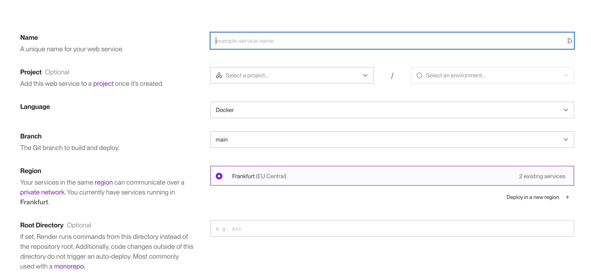
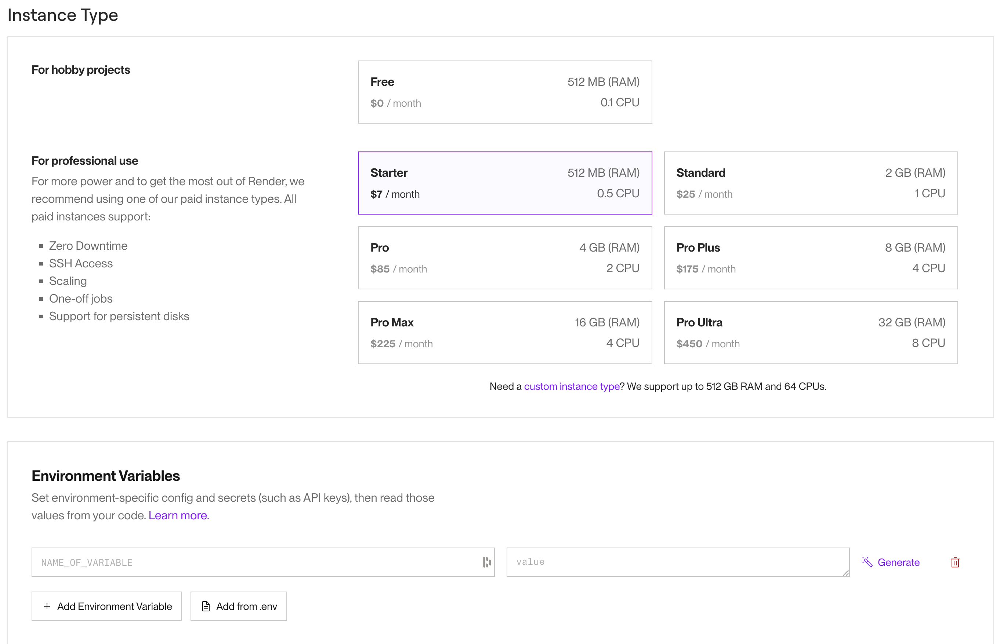
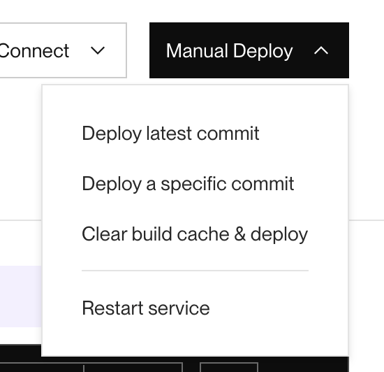

# Déploiement du backend de l'application Watchbox

## Déploiement initial

- Aller sur le site [Render](https://render.com/)
- Se connecter
- (Optionel) Créer un projet
- Créer un web service
  - Indiquer le nom de l'app
  - (Optionel) Ajouter l'app au projet créé
  - Sélectionner le langage du code (automatiquement détecté par Render)
  - Sélectionner la branche du repo git
  - Sélectionner la région
    
  - Sélectionner un plan de facturation
  - Ajouter des variables d'environnement
    
- Déployer le web service
- Le web service est disponible en ligne

## Déploiements futurs

Si render détecte un fichier `render.yaml` à la racine du projet, il pourra l'utiliser pour déclencher des redéploiements automatiques à chaque changement de code sur la branche sélectionnée.

Sinon, on peut redéployer manuellement le web service à l'aide du bouton "Manual Deploy"

