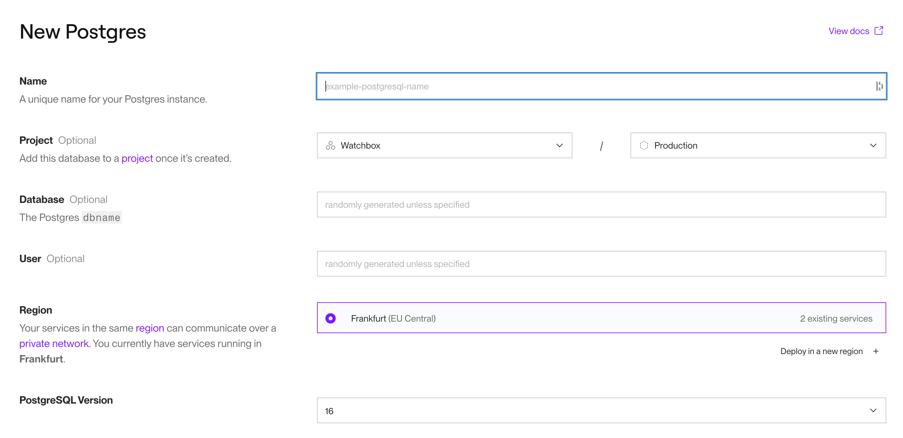

# Déploiement du backend de l'application Watchbox

## Déploiement initial

- Aller sur le site [Render](https://render.com/)
- Se connecter
- (Optionel) Créer un projet
- Créer une base de données postgres
  - Indiquer le nom de l'instance
  - (Optionel) Ajouter l'app au projet créé
  - Sélectionner le nom de la base
  - Sélectionner le nom d'utilisateur
  - Sélectionner la région
  - Sélectionner la version de postgres
    
  - Sélectionner un plan de facturation
- Créer la base de données
- La base est disponible en ligne

## Insertion de données

- D'abord exporter le schéma et les données de la base de données locale
  ```bash
    pg_dump Watchbox > ~/Downloads/watchbox-database-with-data.sql
  ```
  
- Importer le schéma et les données dans la base render
  ```bash
    psql -h watchbox.frankfurt-postgres.render.com -p 5432 -U watchbox_user -d watchbox -f ~/Downloads/watchbox-database-with-data.sql
  ```